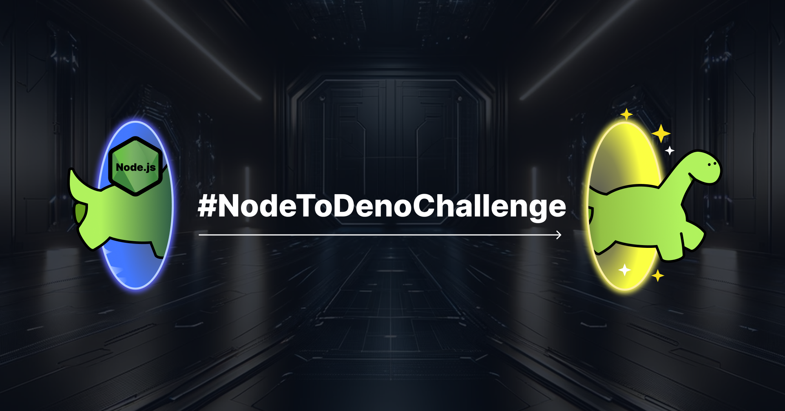

# #NodeToDenoChallenge



> Take any Node project, run it with Deno, earn prizes.

## What is this?

Starting Thursday December 21st and running until January 4th, take any Node
project, run it with Deno, screenshot and share results (success or failure) on
[Twitter](https://twitter.com/deno_land) with the hashtag `#NodeToDenoChallenge`
or as [an issue](https://github.com/denoland/nodetodenochallenge/issues), and
[be eligible to win prizes](#prizes).

## How to participate?

Yes, it’s holiday season and no one can be bothered to do anything, so we’re
making participation as streamlined as possible:

1. Take _any_ Node project. Doesn’t need to be an app or a server. Can be a
   script even.
2. Run this command:

<figure>

```jsx
deno run -A $FILE
```

<figcaption>
<code>$FILE</code> is whichever file you would use in the command <code>node $FILE</code>.
</figcaption>

</figure>

3. Take a screenshot of the output, regardless of success or failure.
4. Share it on [Twitter](https://twitter.com/deno_land) or
   [create a GitHub issue](https://github.com/denoland/nodetodenochallenge/issues).
   (If you want to be eligible for the "largest Node project" category, then you
   must also include a link to the GitHub so we can verify lines of code.)

And that’s it! Have a cup of cocoa and cozy up by the fire.

## Got an error, but _really_ wanna make it work?

First, thanks, we love you. Second, try these flags:

- [`--unstable-byonm`](https://deno.com/blog/v1.38#nodejs-compatibility-improvements):
  The "bring your own node_modules" feature, supported as of
  [1.38](https://deno.com/blog/v1.38), allows you to use Deno with the npm
  package manager of your choice.
- [`--unstable-sloppy-imports`](https://deno.com/blog/v1.39#sloppy-imports):
  supported as of [1.39](https://deno.com/blog/v1.39), which loosens the
  requirements for how Deno imports modules (e.g. import statements don’t need
  file extensions, assumes `index.js`, etc). Note this is not recommended for
  general use.
  [For more details, check out the PR.](https://github.com/denoland/deno/pull/21464)
- [`--unstable-unsafe-proto`](https://deno.com/blog/v1.39#support-for-objectprototype__proto__):
  also suppored as of [1.39](https://deno.com/blog/v1.39), this flag enables
  support for `Object.prototype.__proto__`, which many npm packages rely on to
  function properly. Again, this is not recommended for general use for security
  reasons.

For additional resources on Node/npm interoperability with Deno, check out these
resources:

- [Node.js ⇒ Deno cheatsheet](https://docs.deno.com/runtime/manual/references/cheatsheet)
- [Using Node and npm — Deno manual](https://docs.deno.com/runtime/manual/node/)

## Prizes

On January 4th, 10 randomly selected participants will win a $100 gift card to
[the Deno merch store](https://merch.deno.com).

Additionally, the submission that attempts **to run Deno on the largest Node
project by lines of code is guaranteed to win a $100 gift card**. (Note that in
order to be eligible for this prize, you must share a link to the GitHub project
for us to verify lines of code.)

Finally, to encourage everyone to get the word out and share it with your
circles, **if we get more than 100 submissions, we’ll raise the gift card prize
from $100 to $200**.

We’ll keep track of submission numbers in
[our Discord](https://discord.gg/deno).

_[Read more about the challenge in our blog post.](https://deno.com/blog/node-to-deno-challenge)_
